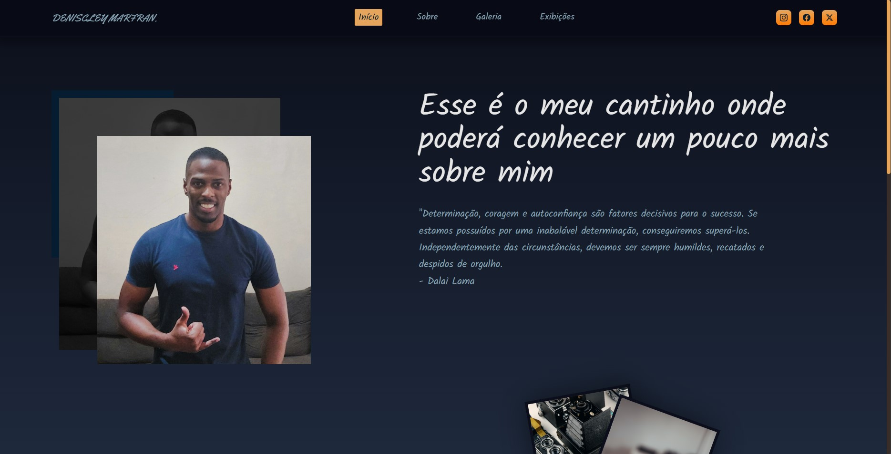

# Galeria de Fotos - Deniscley Marfran

Projeto pessoal de galeria de fotos para divulgação de meus momentos.


## Autores

- [@DeniscleyMarfran](https://github.com/Deniscley)

## Usado por

Esse projeto é usado para fins de conhecimento e divulgação de fotos.

## Funcionalidades

- Preview em tempo real
- Modo tela cheia
- Multiplataforma

## Stack utilizada

**Front-end:** NextJs, TypeScript, HTML5, CSS3, .Net, C#

## Rodando localmente

Clone o projeto

```bash
Primeiro, execute o servidor de desenvolvimento:
  npm run dev
  npm run test

Abra http://localhost:3000 com seu navegador para ver o resultado.

Você pode começar a editar a página modificando app/page.tsx. A página é atualizada automaticamente conforme você edita o arquivo.

Este projeto usa next/font para otimizar e carregar automaticamente Inter, uma fonte personalizada do Google.
```

Inicie a API (Após configurado as Variáveis de Ambiente como citado acima)

```bash
  A maneira de executar um programa depende de onde você começa, do tipo de programa e de você desejar executar no depurador. No caso mais simples, para compilar e executar um projeto aberto no Visual Studio:

Pressione F5, escolha Depurar>Iniciar com depuração no menu do Visual Studio ou selecione a seta verde Iniciar e o nome do projeto na barra de ferramentas do Visual Studio.
Ou, para executar sem depurar, pressione Ctrl+F5 ou escolha Depurar>Iniciar sem depuração no menu do Visual Studio.
```

## Rodando os testes

Para rodar os testes, rode o seguinte comando

```bash
  npm run test
```

## Suporte

Para suporte, mande um email para deniscleymaf@outlook.com

## Etiquetas

Adicione etiquetas de algum lugar, como: [shields.io](https://shields.io/)

[](https://choosealicense.com/licenses/mit/)
[](https://opensource.org/licenses/)
[](http://www.gnu.org/licenses/agpl-3.0)

## Licença

[MIT](https://choosealicense.com/licenses/mit/)

## 🔗 Links

[](https://denis-marfran-portfolio.netlify.app)
[](https://www.linkedin.com/in/deniscleymarfran/)
[](https://twitter.com/DeniscleyMAF)

## Feedback

Se você tiver algum feedback, por favor nos deixe saber por meio de deniscleymaf@outlook.com

## FAQ

#### Qual o objetivo do projeto ?

Galeria pessola de fotos para divulgação de meus momentos.

## Screenshots


